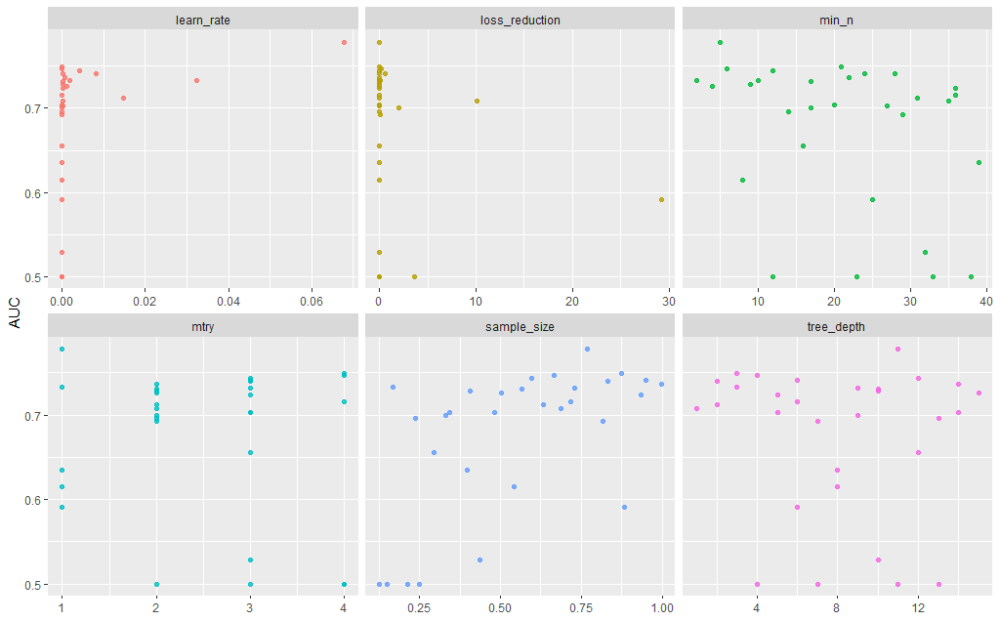
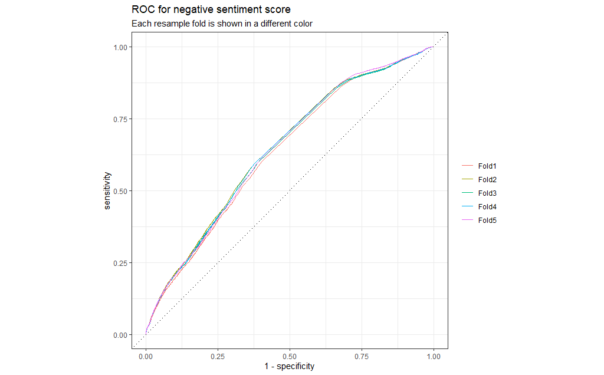

```{r setup, include=FALSE}
knitr::opts_chunk$set(echo = TRUE)
```

## Investigations of sentiment data set using tidytext

Before proceeding to a brute-force modeling approach it is decided to perform a basic text analysis of the dataset. This is mainly because it has been 2 years since the last time that the author worked with NLP and text data. Also the author considers that an understanding of the data set might help him in diagnosing why the model is performing correctly or not and can give additional hindsights helping in the cleaning and feature engineering .

```{r main, message=FALSE, warning=FALSE}
library(vroom)
library(logger)
library(optparse)
library(dplyr)
library(tidyr)
library(tidytext)
library(textdata)
library(stringr)
library(stopwords)
library(tidymodels)
library(textrecipes)
library(discrim)
library(tune)
library(dials)
library(vip)
library(yardstick)

source("../code/get_data.R")
source("../code/process_data.R")
source("../code/plotting_utils.R")
source("../code/train.R")
```

First we investigate the class balance in the original dataset:

```{r message=FALSE, warning=FALSE}
twitter_data_big <- loadData(input_path = "../data/input/", 
                                    file_name = "twitter_dataset_full.csv") %>% 
  select(is_positive, message)
```
```{r}
ggplot(twitter_data_big, aes(is_positive))+geom_bar() + xlab("Class") + ylab("Number of entities")
```
The data set seems perfectly balanced so we do not need to worry about class imbalance.


## Basic sentiment analysis

After the dataset is loaded we proceed to execute the preprocessing pipeline. It is important to mention that there are two steps in this pipeline.

1. The cleaning of the message column which basically includes: removing retweets, special characters (@, #, <,>), removing urls (http and https) and forcing the lower case of the messages.
2. The feature engineering and feature augmentation where we tokenize the text, remove stopwords, calculate ngrams, calculate tf-idf and we limit the number of tokens (which potentially can be considered as an hyperparameter).

We select a random sample of the original dataset (due to computation resources limitations) with maximum 50000 datapoints.

```{r message=FALSE, warning=FALSE}
processed_data <- processorBasic(df = twitter_data_big,
                                 sample_size = 50000)
```
We get the top words of the sample dataset, this time we remove the stop words here as well to get meaningful results.

```{r}
get_top_words(processed_data, 6)
```
We also perform a very vanilla sentiment analisys:

```{r message=FALSE, warning=FALSE}
sentiment_results <- sentimentAnalyser(cleaned_df = processed_data, 
                                       engine = "bing")
```
```{r}
get_sentiments_plot(sentiment_results,number_top = 8)
```
We can see how a simple sentiment engine is actually getting some words in the rigth box (omitting of course any kind of context or additional text corpus information) but this could be an indicator that an ML or DL algorithm will be able to produce some results.


## Training Pipeline - XGBoost

As described before we execute the second part of the preprocessing pipeline, the steps can be found in code/train.R @trainRecipe(), we also generate a grid to tune xgboost, and we also generate an stratification sampling:

```{r message=FALSE, warning=FALSE}

training_configuration <- trainRecipe(processed_data, 
            max_tokens = 400)
xgb_model <- modelDef(mode = "classification", 
                      engine = "xgboost")
xgb_grid <- xgbGrid(training_data = training_configuration[[2]])

folds <- vfold_cv(training_configuration[[2]], 
                  v = 3,
                  strata = "is_positive",
                  repeats = 1)

load_model <- readRDS(file = "../model/xgboost+recipes.rds")
```

We execute the training process (not show here because if not the notebook render takes ages) and we save the model in the model folder. Below it is displayed the results of the HPO:

[](../plots/xgboost_tunning.png)


We also plot the ROC curve for the best model:

[](../plots/negative_score_roc.png)


## Inference Pipeline

Now with the trained model in the subset of the large data set we try to predict in the one attached in the modulai github repo.

As we trained XGBoost as binary classifier our predictions will be 0 or 1. Meanwhile the BART model was producing an score. Despite of not being completely a fair comparison we replace every score >= 0.5 in the BART model by a 1 class prediction and 0 otherwise:

```{r include=FALSE}
twitter_data_small <- loadData(input_path = "../data/input/", 
                                    file_name = "dataset_small_w_bart_preds.csv")

twitter_data_small <- twitter_data_small %>% 
  rename(text_stripped = message_clean) %>% 
  mutate(is_positive = as.factor(is_positive))

twitter_data_small <- twitter_data_small %>% 
  mutate(xgboost_pred = as.numeric(predict(load_model, twitter_data_small)$.pred_class)) %>% 
  mutate(binary_bart = case_when(
    bart_is_positive >= 0.5~1,
    bart_is_positive < 0.5~0
  ))
```

```{r}
```


```{r}
twitter_data_small %>% head()
```

We then compute the ROC metrics in this new dataset for the two models

```{r}
roc_auc(twitter_data_small, truth = is_positive, binary_bart)
```

```{r}
roc_auc(twitter_data_small, truth = is_positive, xgboost_pred)
```

Based on the ROC_AUC metrics BART is overperforming xgboost. However as it was mentioned before this is not a 100% perfect comparison.

